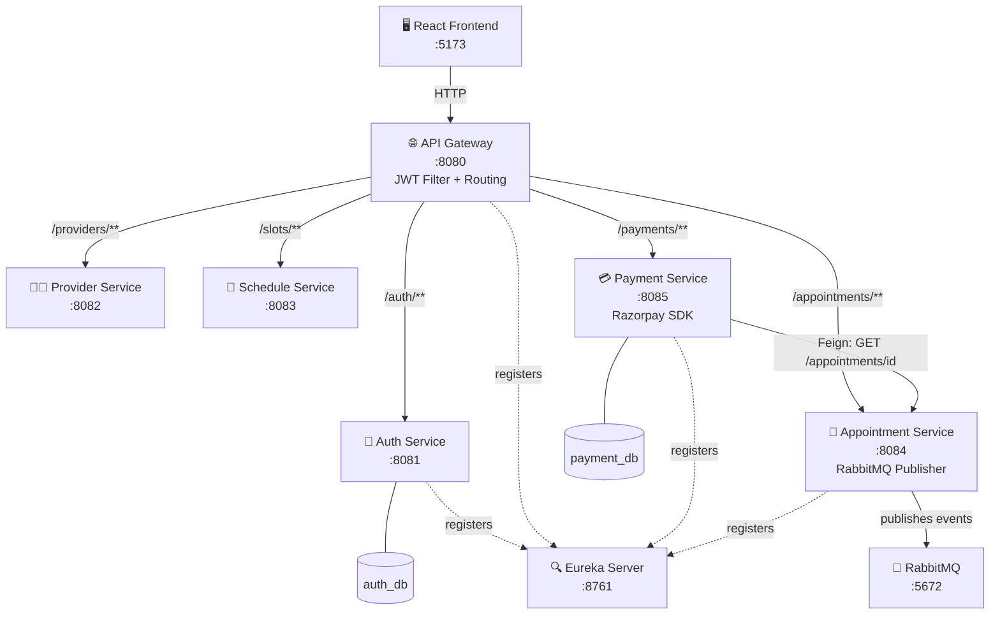
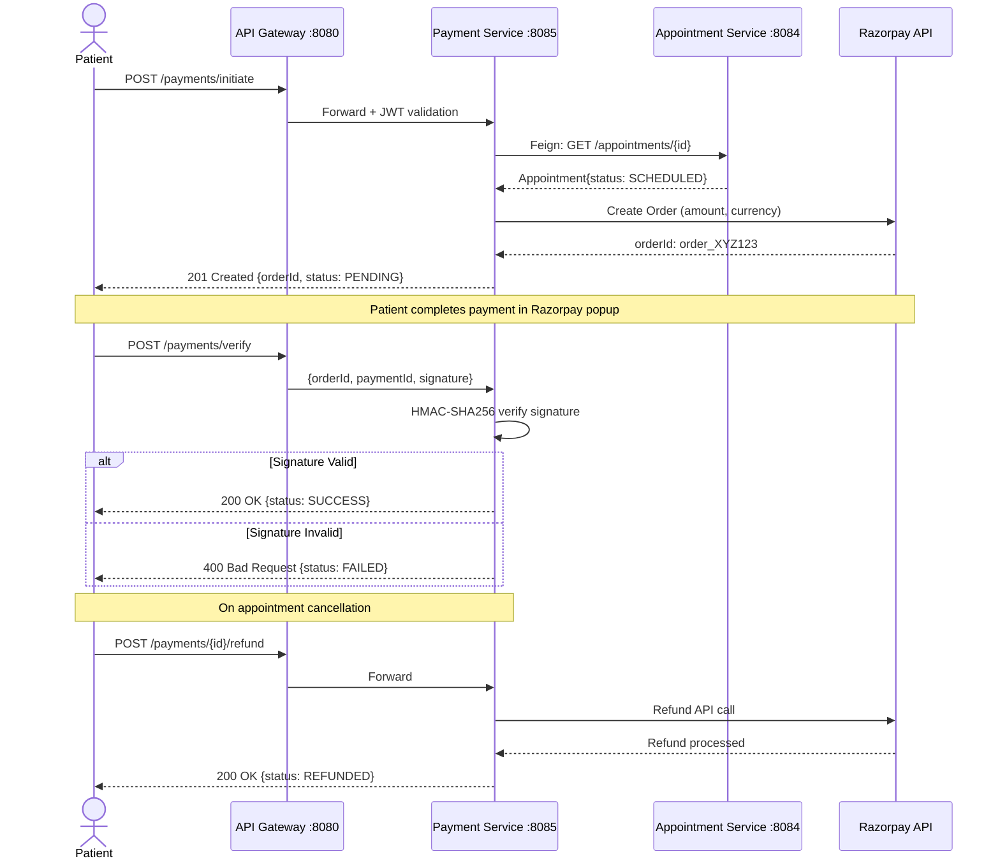
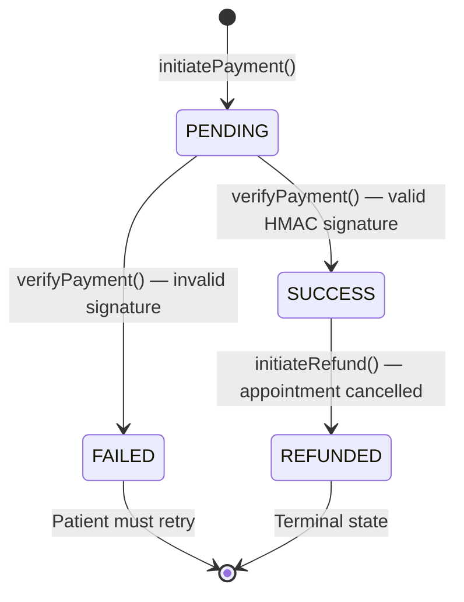

<div align="center">

# 💳 MediBook — Payment Service

### `feature/UC5-payment-service`

[](https://spring.io/projects/spring-boot)
[](https://www.oracle.com/java/)
[](https://www.mysql.com/)
[](https://razorpay.com/)
[](https://spring.io/projects/spring-security)
[](https://spring.io/projects/spring-cloud-netflix)
[](LICENSE)

> **UC5** · Razorpay-Ready Payment Engine · HMAC-SHA256 Verification · Full Refund Support · Revenue Analytics

</div>

---

## 📋 Table of Contents

| # | Section |
|---|---------|
| 01 | [Project Overview](#-project-overview) |
| 02 | [System Architecture](#-system-architecture) |
| 03 | [All Microservices](#-all-microservices) |
| 04 | [Payment Service Deep Dive](#-payment-service-deep-dive) |
| 05 | [API Reference](#-api-reference) |
| 06 | [Payment Flow](#-payment-flow) |
| 07 | [Status Lifecycle](#-payment-status-lifecycle) |
| 08 | [API Testing Guide](#-api-testing-guide) |
| 09 | [Environment Variables](#-environment-variables) |
| 10 | [Quick Start](#-quick-start) |

---

## 🏥 Project Overview

**MediBook** is an Online Appointment Booking System built as a distributed microservices platform using Spring Boot, Spring Cloud, and Spring Security. It enables patients to book appointments with healthcare providers, manage slots, process payments, and receive notifications — all orchestrated through an API Gateway with JWT authentication.

The **UC5 Payment Service** is the financial backbone of the platform. It handles the complete payment lifecycle:

- ✅ Payment initiation via **Razorpay SDK**
- ✅ **HMAC-SHA256** signature verification
- ✅ Automated **refund processing**
- ✅ Revenue **analytics** for admins
- ✅ **Gateway-agnostic architecture** — zero breaking changes when switching payment providers

> 💡 **Design Principle:** The `PaymentService` interface is the stable contract. `PaymentServiceImpl` is the swappable implementation. The controller depends only on the interface — switching from mock to real Razorpay requires **zero controller changes**.

---

## 🏗 System Architecture



---

## 🧩 All Microservices

| Service | Port | Database | Key Technologies | Description |
|---------|------|----------|-----------------|-------------|
| 🔍 **Eureka Server** | `8761` | — | Spring Eureka | Service discovery hub. **Start this first.** |
| 🌐 **API Gateway** | `8080` | — | Spring Cloud Gateway, JWT | Single entry point. Routes all traffic. CORS for `:5173`. |
| 🔑 **Auth Service** | `8081` | `auth_db` | Spring Security, JWT, SMTP | Registration, login, token generation. Roles: PATIENT, DOCTOR, ADMIN. |
| 👨‍⚕️ **Provider Service** | `8082` | `provider_db` | JPA | Doctor/provider profile management. Specialty, bio, fees. |
| 📅 **Schedule Service** | `8083` | `schedule_db` | JPA, Slot Locking | Time-slot management. Create and book available slots. |
| 🏥 **Appointment Service** | `8084` | `appointment_db` | Feign, RabbitMQ | Core booking engine. Manages appointment lifecycle. No-show scheduler. |
| 💳 **Payment Service** ⭐ | `8085` | `payment_db` | Razorpay SDK, Feign, HMAC | **UC5 — This service.** Full payment lifecycle. |

---

## 💳 Payment Service Deep Dive

### 📦 Entity: `Payment`

Maps to the `payments` MySQL table. Every transaction — successful or failed — creates a permanent record for audit trail compliance.

| Field | Type | Constraint | Description |
|-------|------|-----------|-------------|
| `paymentId` | INT | PK, AUTO | Primary key, auto-generated |
| `appointmentId` | INT | UNIQUE, NOT NULL | One payment per appointment |
| `patientId` | INT | NOT NULL | Links to auth-service user |
| `amount` | DOUBLE | NOT NULL | Amount in ₹ (rupees) |
| `currency` | VARCHAR | NOT NULL | Default: `INR` |
| `paymentMethod` | VARCHAR | NOT NULL | `CARD` / `UPI` / `NETBANKING` / `WALLET` |
| `status` | VARCHAR | NOT NULL | `PENDING` / `SUCCESS` / `FAILED` / `REFUNDED` |
| `razorpayOrderId` | VARCHAR | — | Razorpay order ID (or `MOCK_ORDER_N`) |
| `razorpayPaymentId` | VARCHAR | — | Razorpay payment ID after completion |
| `razorpaySignature` | VARCHAR | — | HMAC-SHA256 verification hash |
| `createdAt` | DATETIME | NOT NULL, immutable | Auto-set on `@PrePersist` |
| `updatedAt` | DATETIME | — | Auto-set on `@PreUpdate` |
| `notes` | TEXT | — | System-generated audit notes |

### 🔌 Service Interface: `PaymentService`

```java
public interface PaymentService {
    PaymentResponse initiatePayment(PaymentRequest request);
    PaymentResponse verifyPayment(String orderId, String paymentId, String signature);
    PaymentResponse getPaymentByAppointment(int appointmentId);
    PaymentResponse getPaymentById(int paymentId);
    List<Payment> getPaymentsByPatient(int patientId);
    PaymentResponse initiateRefund(int paymentId);
    List<Payment> getPaymentsByStatus(String status);
    List<Payment> getPaymentsByProvider(int providerId);
    double getTotalRevenue();
    void updatePaymentStatus(int paymentId, String status);
}
```

### 🔗 Feign Client: `AppointmentClient`

Payment service verifies appointment status before processing payment via a Feign call to `appointment-service`:

```java
@FeignClient(name = "appointment-service")
public interface AppointmentClient {
    @GetMapping("/appointments/{appointmentId}")
    AppointmentDto getById(@PathVariable int appointmentId);
}
```

### 🗄️ Repository: Key Queries

```java
// Find payment for an appointment
Optional<Payment> findByAppointmentId(int appointmentId);

// Find by Razorpay order ID (used during verification)
Optional<Payment> findByRazorpayOrderId(String razorpayOrderId);

// Calculate total revenue from successful payments
@Query("SELECT SUM(p.amount) FROM Payment p WHERE p.status = 'SUCCESS'")
Double calculateTotalRevenue();

// Payments by provider (native SQL JOIN)
@Query(value = "SELECT p.* FROM payments p " +
       "JOIN appointments a ON p.appointment_id = a.appointment_id " +
       "WHERE a.provider_id = :providerId ORDER BY p.created_at DESC",
       nativeQuery = true)
List<Payment> findPaymentsByProvider(@Param("providerId") int providerId);
```

---

## 📡 API Reference

> **Base URL (via Gateway):** `http://localhost:8080/payments`
> **Direct URL:** `http://localhost:8085/payments`
> **Swagger UI:** `http://localhost:8085/swagger-ui.html`
>
> All endpoints require: `Authorization: Bearer <JWT_TOKEN>`

### Core Payment Operations

| Method | Endpoint | Auth | Description |
|--------|----------|------|-------------|
| `POST` | `/payments/initiate` | 🔐 JWT | Initiate payment — creates Razorpay order |
| `POST` | `/payments/verify` | 🔐 JWT | Verify payment signature → set SUCCESS/FAILED |
| `POST` | `/payments/{paymentId}/refund` | 🔐 Admin | Initiate refund for a successful payment |

### Query Endpoints

| Method | Endpoint | Auth | Description |
|--------|----------|------|-------------|
| `GET` | `/payments/appointment/{appointmentId}` | 🔐 JWT | Get payment by appointment ID |
| `GET` | `/payments/{paymentId}` | 🔐 JWT | Get payment by payment ID |
| `GET` | `/payments/patient/{patientId}` | 🔐 JWT | Get all payments for a patient |
| `GET` | `/payments/provider/{providerId}` | 🔐 Admin | Get all payments for a provider |
| `GET` | `/payments/status?status=SUCCESS` | 🔐 Admin | Filter payments by status |
| `GET` | `/payments/revenue/total` | 🔐 Admin | Total revenue from all SUCCESS payments |

### Admin Operations

| Method | Endpoint | Auth | Description |
|--------|----------|------|-------------|
| `PUT` | `/payments/{paymentId}/status?status=SUCCESS` | 🔐 Admin | Manually update payment status |

---

## 🔄 Payment Flow



---

## 📊 Payment Status Lifecycle



| Status | Trigger | Can Transition To | Description |
|--------|---------|------------------|-------------|
| `PENDING` | `initiatePayment()` | SUCCESS, FAILED | Order created, awaiting patient |
| `SUCCESS` | `verifyPayment()` — valid | REFUNDED | Payment confirmed, appointment active |
| `FAILED` | `verifyPayment()` — invalid | — | Payment tampered or declined |
| `REFUNDED` | `initiateRefund()` | — | Money returned after cancellation |

---

## 🧪 API Testing Guide

> ⚠️ **Prerequisites:** All services running · MySQL up · Valid JWT token from auth-service

### Step 1 — Obtain JWT Token

```bash
# Register a patient
curl -X POST http://localhost:8080/auth/register \
  -H "Content-Type: application/json" \
  -d '{
    "name": "Test Patient",
    "email": "patient@test.com",
    "password": "Password@123",
    "role": "PATIENT"
  }'

# Login → copy the token from response
curl -X POST http://localhost:8080/auth/login \
  -H "Content-Type: application/json" \
  -d '{"email":"patient@test.com","password":"Password@123"}'

# Save token for reuse
TOKEN="eyJhbGciOiJIUzI1NiJ9..."
```

---

### Step 2 — Initiate Payment

```bash
curl -X POST http://localhost:8080/payments/initiate \
  -H "Content-Type: application/json" \
  -H "Authorization: Bearer $TOKEN" \
  -d '{
    "appointmentId": 5,
    "patientId": 12,
    "amount": 500.00,
    "paymentMethod": "UPI",
    "currency": "INR"
  }'
```

**✅ 201 Created Response:**
```json
{
  "paymentId": 1,
  "appointmentId": 5,
  "status": "PENDING",
  "amount": 500.0,
  "currency": "INR",
  "paymentMethod": "UPI",
  "razorpayOrderId": "order_NiXe5u3kZ9XYAB",
  "razorpayPaymentId": null,
  "message": "Order created. Complete payment in popup.",
  "transactionTime": "2026-04-22 10:30:00"
}
```

---

### Step 3 — Verify Payment

```bash
# Real Razorpay mode
curl -X POST http://localhost:8080/payments/verify \
  -H "Content-Type: application/json" \
  -H "Authorization: Bearer $TOKEN" \
  -d '{
    "razorpayOrderId": "order_NiXe5u3kZ9XYAB",
    "razorpayPaymentId": "pay_ABC123XYZ456",
    "razorpaySignature": "<hmac_sha256_signature>"
  }'

# Mock mode (MOCK_ prefix skips signature check)
curl -X POST http://localhost:8080/payments/verify \
  -H "Content-Type: application/json" \
  -H "Authorization: Bearer $TOKEN" \
  -d '{
    "razorpayOrderId": "MOCK_ORDER_5",
    "razorpayPaymentId": "MOCK_PAY_1712345678",
    "razorpaySignature": null
  }'
```

**✅ 200 OK Response:**
```json
{
  "paymentId": 1,
  "status": "SUCCESS",
  "razorpayPaymentId": "pay_ABC123XYZ456",
  "message": "Payment successful. Appointment confirmed."
}
```

---

### Step 4 — Initiate Refund

```bash
curl -X POST http://localhost:8080/payments/1/refund \
  -H "Authorization: Bearer $ADMIN_TOKEN"
```

**✅ 200 OK Response:**
```json
{
  "paymentId": 1,
  "status": "REFUNDED",
  "message": "Refund initiated successfully."
}
```

---

### Step 5 — Query Endpoints

```bash
# Get payment by appointment ID
curl http://localhost:8080/payments/appointment/5 \
  -H "Authorization: Bearer $TOKEN"

# Get payment by payment ID
curl http://localhost:8080/payments/1 \
  -H "Authorization: Bearer $TOKEN"

# Get all payments for a patient
curl http://localhost:8080/payments/patient/12 \
  -H "Authorization: Bearer $TOKEN"

# Get all payments for a provider
curl http://localhost:8080/payments/provider/3 \
  -H "Authorization: Bearer $ADMIN_TOKEN"
```

---

### Step 6 — Admin Analytics

```bash
# Total platform revenue
curl http://localhost:8080/payments/revenue/total \
  -H "Authorization: Bearer $ADMIN_TOKEN"
```

**✅ 200 OK Response:**
```json
{
  "totalRevenue": 125000.0,
  "currency": "INR",
  "message": "Total revenue from all successful payments"
}
```

```bash
# Filter by status
curl "http://localhost:8080/payments/status?status=FAILED" \
  -H "Authorization: Bearer $ADMIN_TOKEN"

curl "http://localhost:8080/payments/status?status=REFUNDED" \
  -H "Authorization: Bearer $ADMIN_TOKEN"

curl "http://localhost:8080/payments/status?status=PENDING" \
  -H "Authorization: Bearer $ADMIN_TOKEN"

# Manually update payment status (admin fix / webhook handler)
curl -X PUT "http://localhost:8080/payments/1/status?status=SUCCESS" \
  -H "Authorization: Bearer $ADMIN_TOKEN"
```

---

### ❌ Error Scenarios

```bash
# 409 Conflict — duplicate payment for same appointment
curl -X POST http://localhost:8080/payments/initiate \
  -H "Content-Type: application/json" \
  -H "Authorization: Bearer $TOKEN" \
  -d '{"appointmentId": 5, "patientId": 12, "amount": 500, "paymentMethod": "UPI"}'

# 400 Bad Request — invalid status filter
curl "http://localhost:8080/payments/status?status=INVALID" \
  -H "Authorization: Bearer $ADMIN_TOKEN"

# 400 Bad Request — refund a non-SUCCESS payment
curl -X POST http://localhost:8080/payments/99/refund \
  -H "Authorization: Bearer $ADMIN_TOKEN"

# 404 Not Found — payment does not exist
curl http://localhost:8080/payments/9999 \
  -H "Authorization: Bearer $TOKEN"

# 401 Unauthorized — missing auth header
curl http://localhost:8080/payments/revenue/total
```

---

### 🧪 Swagger UI

> Open **`http://localhost:8085/swagger-ui.html`** for interactive testing.
> Click **Authorize** → paste your Bearer token → test any endpoint with **Try it out**.

---

## ⚙️ Environment Variables

### Payment Service

| Variable | Default | Required | Description |
|----------|---------|----------|-------------|
| `JWT_SECRET` | — | ✅ Required | Must match across **all** services. Min 256-bit key. |
| `DB_USERNAME` | `medibook_user` | ⬜ Optional | MySQL username for `payment_db` |
| `DB_PASSWORD` | `medibook_pass` | ⬜ Optional | MySQL password for `payment_db` |
| `RAZORPAY-API-KEY` | — | ✅ Required | Razorpay API key ID from dashboard |
| `RAZORPAY-KEY-SECRET` | — | ✅ Required | Razorpay key secret for HMAC signing |
| `EUREKA_DEFAULT_ZONE` | `localhost:8761` | ⬜ Optional | Eureka server URL with credentials |

### Auth Service (Additional)

| Variable | Description |
|----------|-------------|
| `MAIL_HOST` | SMTP host (default: `smtp.gmail.com`) |
| `MAIL_PORT` | SMTP port (default: `587`) |
| `MAIL_USERNAME` | Gmail address for sending OTP emails |
| `MAIL_PASSWORD` | Gmail **App Password** (not account password) |

---

## 🚀 Quick Start

### 1. Database Setup

```sql
-- Run as MySQL root
CREATE USER 'medibook_user'@'localhost' IDENTIFIED BY 'medibook_pass';
GRANT ALL PRIVILEGES ON *.* TO 'medibook_user'@'localhost';
FLUSH PRIVILEGES;
-- Databases are auto-created by Spring (createDatabaseIfNotExist=true)
```

### 2. Service Startup Order

> ⚠️ **Order matters!** Eureka must be up before any other service registers.

```bash
# 1️⃣ Start Eureka Server FIRST
cd eureka-server && mvn spring-boot:run

# 2️⃣ Start API Gateway SECOND
cd api-gateway && mvn spring-boot:run

# 3️⃣ Start all other services (any order)
cd auth-service        && mvn spring-boot:run &
cd provider-service    && mvn spring-boot:run &
cd schedule-service    && mvn spring-boot:run &
cd appointment-service && mvn spring-boot:run &
cd payment-service     && mvn spring-boot:run &
```

### 3. Port Reference

| Service | Port | URL |
|---------|------|-----|
| 🔍 Eureka Server | `8761` | http://localhost:8761 — `admin / medibook123` |
| 🌐 API Gateway | `8080` | http://localhost:8080 |
| 🔑 Auth Service | `8081` | http://localhost:8081 |
| 👨‍⚕️ Provider Service | `8082` | http://localhost:8082 |
| 📅 Schedule Service | `8083` | http://localhost:8083 |
| 🏥 Appointment Service | `8084` | http://localhost:8084 |
| 💳 **Payment Service** ⭐ | **`8085`** | http://localhost:8085 · Swagger: `/swagger-ui.html` |

### 4. Build All Services

```bash
# Build all modules from project root
mvn clean install -DskipTests

# Build payment-service only
cd payment-service && mvn clean package -DskipTests
```

> ✅ **All APIs are routed via Gateway on port `8080`.**
> Use `http://localhost:8080/payments/...` for all requests.
> Direct `:8085` access is for Swagger UI and local debugging only.

---

## 📁 Project Structure

```
MediBook-Microservices/
├── pom.xml                      ← Parent POM (all modules)
├── eureka-server/               ← :8761 — Start first
├── api-gateway/                 ← :8080 — JWT filter + routing
├── auth-service/                ← :8081 — JWT issuance
├── provider-service/            ← :8082 — Doctor profiles
├── schedule-service/            ← :8083 — Slot management
├── appointment-service/         ← :8084 — Booking engine
└── payment-service/             ← :8085 — UC5 ⭐
    └── src/main/java/com/medibook/payment/
        ├── resource/            ← REST controllers
        ├── service/             ← Interface + Impl
        ├── entity/              ← Payment entity
        ├── dto/                 ← Request / Response DTOs
        ├── repository/          ← JPA queries
        ├── client/              ← Feign: AppointmentClient
        ├── config/              ← Security, OpenAPI
        └── exception/           ← Global exception handler
```

---

## Author👨‍💻

[Harshal Choudhary](https://github.com/Harshal-25C) - Software Developer👨‍💻 | Cloud Enthusiast  
B.Tech - `[Computer Science & Engineering]`  
Java | Spring Boot | Spring Security | JWT | MySQL | Clean Architecture

---

<div align="center">

**MediBook Microservices** · `feature/UC5-payment-service`

Spring Boot 3.2 · Java 17 · Razorpay · MySQL · Spring Cloud Eureka · JWT

[](https://spring.io)

</div>